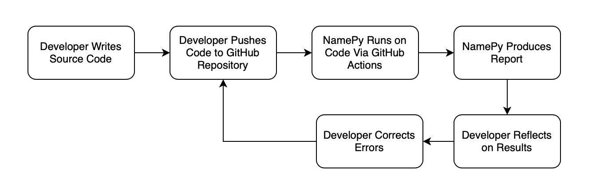
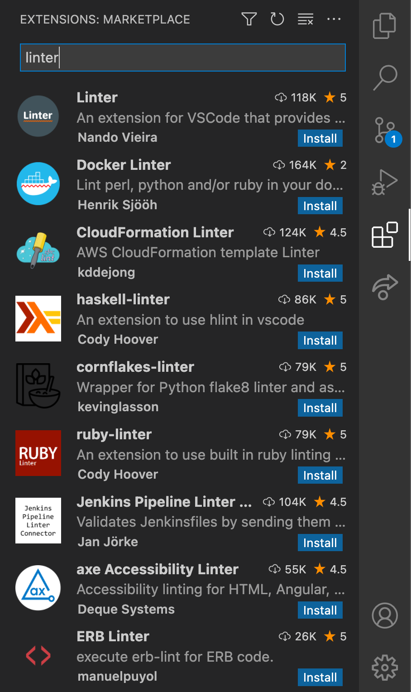
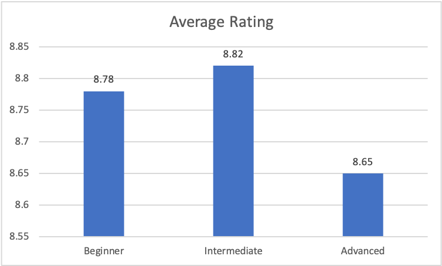
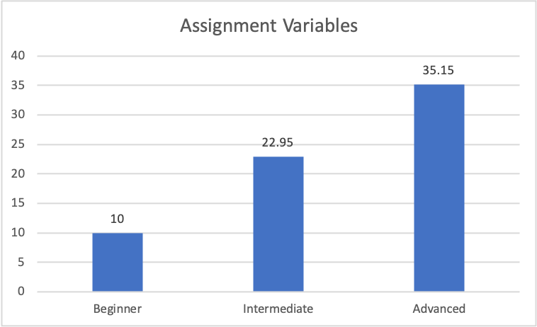
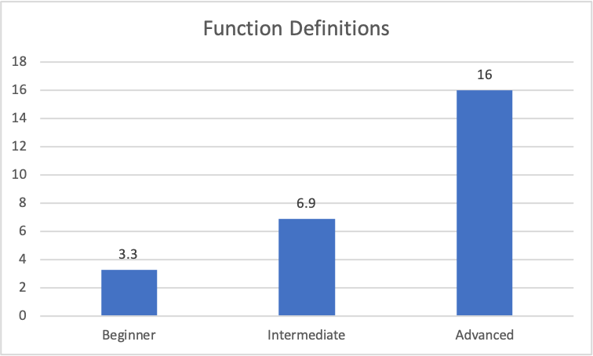
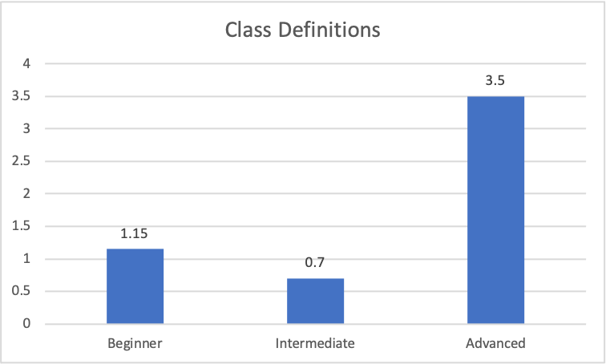
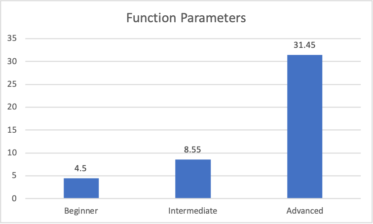

# Chapter 1: Introduction

## 1.1 Statement of the problem

Creating identifiers when writing programs is an important and necessary part of every developer's job. As opposed to many other words used in source code, identifiers are created by the developer, not preset by libraries or programming languages. This fact in itself creates a task that must be addressed: Identifier names must be created and thought-over with care. There is not much attention paid to this idea due to the fact that most names are functional and therefore any name suffices. Though, this functionality only applies at the machine level. Computers do not care about the names of identifiers, but humans do. In this way, they act as a form of correspondence between writers and readers of code. Since identifiers are assigned to and reference entities in programs, it is vital that they are well-created for the sake of readability. To experienced professionals this task should come easily, but to students it is not so simple. Without the experience to know how to properly format an identifier based on its context, student-created identifiers often fall short of expectations. One such formatting aspect that is associated with them is name length. Name length is a good indicator of the general descriptiveness of a word. By conducting a Python study with the identifiers of students, Python libraries and textbooks, Wang et al. demonstrated a clear distinction with the identifier lengths of students [@Wang].

![The naming length distribution of integers and floats in different data sets [@Wang].](images/int-float_naming.jpg)

Figure 1 shows the lowest name length out of the three sources being students at an average of 3.82 characters and a standard deviation of 3.57 characters. In contrast, the combined five libraries have an average length of 6.38 characters and a standard deviation of 4.08 characters. Similarly the textbook has an average length of 6.35 characters and a standard deviation of 4.10 characters.

![The naming length distribution of functions in different data sets [@Wang].](images/function_naming.jpg)

Figure 2 also shows the lowest name length out of the three sources being students at an average of 4.35 characters and a standard deviation of 4.34 characters. The combined five libraries have an average length of 12.22 characters  and a standard deviation of 4.73 characters. The textbook has an average of 7.79 characters and a standard deviation of 2.76 characters.

![The naming length distribution of arguments in different data sets [@Wang].](images/argument_naming.jpg)

Continuing with the pattern, Figure 3 shows the shortest name lengths coming from students with an average of 1.86 characters and a standard deviation of 2.36 characters. The combined five libraries have an average length of 4.97 characters and a standard deviation of 1.94 characters. The textbook has an average of 5.04 characters and a standard deviation of 5.27 characters.

![The naming style distribution of integers and floats in different data sets [@Wang].](images/int-float-style.jpg)

Table: Eight commonly used naming styles [@Wang]

| Naming Styles                                       | Example     |
|-----------------------------------------------------|-------------|
| single lowercase letter                             | a           |
| single uppercase letter                             | A           |
| lowercase (without underscores)                     | item        |
| lowercase with underscores                          | Item_method |
| uppercase (without underscores)                     | SIZE        |
| uppercase with underscores                          | ITEM_SIZE   |
| capitalized word (or CamelCase) without underscores | BenchAark   |
| capitalized words with underscores                  | Bench_Aark  |

Figure 4 shows the naming styles that are most common amongst each source from Table 1. With students, single lowercase style had the highest percentage at 38.02%. Both the textbook and the five libraries resulted in the lowercase without underscore style being the most prevalent. The libraries consisted of 50.64% with this style and the textbook consisted of 35.90%.

Three possible explanations exist for the trend of short identifier lengths of the student code analyzed with Figures 1-4. The first possibility for identifiers being short is intentional obfuscation. This is defined as transforming "the program's code into another version, which is syntactically different but semantically the same" [@Rajkumar]. This method is often used by programmers "to make the code more complex and difficult to understand" [@Rajkumar]. Often it is used to either protect against malicious attacks or to make it difficult for others to utilize their code.

Given that the focused source of data in Figures 1-4 comes from students rather than professional developers, it is safe to say that unintentional obfuscation is the more likely explanation for short identifier lengths. The first reason this may occur is due to an overall lack of sufficient knowledge regarding identifiers. Due to the nature of identifiers not requiring specific conventions, the concept of good naming practice must be taught to students. Without adequate explanation for them to name identifiers in descriptive ways, students tend to steer toward the use of one-character names as seen in Figures 3 and 4. Figures 1 and 2 also demonstrate this shortcoming, though the student averages are slightly higher (though still too short to be adequately descriptive).

The second reason that unintentional obfuscation may occur is due to student practices in other disciplines. Namely, mathematics (particularly algebra) focuses on variables. While programming and algebra both leverage variables, they are treated very differently. Saraswati et al. state that "Most of learning processes are only acquainted with the formal strategy in teaching linear equation with one variable" [@Saraswati]. This means that algebra students use formal tactics to deal with equations that are often linear rather than abstract tactics like those that are necessary to understand programmatic identifiers. In addition, linear equations consist of one or more variables defined with one character each. In this way, students with preset notions about variable meaning based on algebraic concepts may tend to name programmatic variables/identifiers in the same fashion.

Along with this, the fundamental concept that is learned in algebra is to solve for the variable(s) in an equation. In Computer Science this concept is not the same. Rather, variables are used as functional assignments to leverage in other locations of a program. These assignments also have the capacity for more than just numbers (strings for example). Given this, students are required to learn a new understanding of variables/identifiers in order to create better names. To learn better practices and instill beneficial habits regarding programmatic naming conventions, NamePy is designed to help. With the aid of a practical tool in addition to classroom teaching of the proper concepts, the students trends that are seen in Figures 1-4 should shift toward the trends of the textbook and libraries.

The name-length and style examples show one piece of the puzzle that inexperienced programmers are faced with. While Python identifiers can technically be named freely, there is an importance to consider in carefully choosing those names. Identifiers that are not thoughtfully named will likely cause difficulty for third party readers of the code. Even though `x` may be a variable that is able to identify an assignment, audiences of the code will not have this insider knowledge and therefore will not be able to read and comprehend the program in an effective manner. Better yet, developers themselves will often have trouble in understanding their own code when they revisit it after a length of time. Detailed comments help in this case, but readability is still compromised when it is necessary to repeatedly refer to them. In addition, clear identifiers that are accurately descriptive are instrumental in debugging code as well as increasing parsing efficiency due to an increase in readability and comprehension.

```python
o = int(input("option(1/2):"))
if(o == 1):
    x = float(input("Temperature in Celsius:"))
    y = 1.8 * (x) + 32.0
    print("Temperature in Fahrenheit:",y)
elif(o == 2):
    y = float(input("Temperature in Fahrenheit:"))
    x = (f-32)/1.8
    print("Temperature in Celsius:",x)
```

By using single lowercase variables in the sample program above, it is difficult to keep track of each variables' meaning. To do so, the assignments of those variables must be referred to constantly.

```python
option = int(input("option(1/2):"))
if(option == 1):
    celsius = float(input("Temperature in Celsius:"))
    fahrenheit = 1.8 * (celsius) + 32.0
    print("Temperature in Fahrenheit:",fahrenheit)
elif(option == 2):
    fahrenheit = float(input("Temperature in Fahrenheit:"))
    celsius = (f-32)/1.8
    print("Temperature in Celsius:",celsius)
```

By using longer, descriptive variable names in the sample program above, it is easier to keep track of each variables' meaning. There is no need to look back at the assignment statements because the names are descriptive enough to know their function.

Factors that can be associated with the quality of identifiers are length, style, grammar, existence of associated comments and comprehension. These naming qualities will be further discussed regarding their impact on overall identifier quality.

## 1.2 Overall aim

The solution presented to solve this problem is NamePy, an identifier-focused linter for beginning Python developers. The tool will aim to assist students with creating quality identifiers that are similar to those made my professionals. At a glance, the tool will:

- Be leveraged by Python users
- Follow a predetermined set of standards
- Output error/suggestion messages when standards are not met
- Provide program scores

The study by Wang et al. used name-length and name-style for comparison to determine some "ideal" standards/suggestions for Python students [@Wang]. This same type of logic is what will drive the set of standards that the tool will use to evaluate identifiers. The features and their specifics are determined by the research done in the next section. With the features and their limits decided, the tool will parse its given program, find its identifiers and analyze them based on the standards. If names are determined to conflict with the predetermined rules of the linter, error messages will be produced in an attempt to help the user solve the issues. In addition to this, scores will be produced based on the evaluation for optimal visualization.

As a student-aimed tool, NamePy is intended to be used as a resource to instill good habits in student developers. While many popular linters are used by experienced users in their project builds, this tool is meant to be "graduated" from. Used for evaluation, it will help students to more quickly bridge the gap that exists between low and high level programmers in regard to identifier naming. With this intent reached, beginning Python developers will improve their identifier quality and therefore overall code quality for all projects to come.

## 1.3 Motivation

This project idea initialized with my background in the Computer Science field starting as a beginner. Given that there is much to learn at the early stages of programming, naming conventions was one area that had a large bridge to cross. Until I gained more experience, the importance of identifier aspects like style, grammar and content was not clear. A large amount of trial and error was used until fundamental ideas and practices were achieved. Figures 1-4 suggest a similar experience among other students. With prior experience, I am pursuing this project to aid other developers in the struggles that I faced.

Another goal of the creation of NamePy is to explore the complexities of programmatic naming conventions. Given the somewhat creative nature of identifiers there is inherently no perfect or ideal name for any given assignment. This is where research comes into play to determine a robust set of tool standards based on the findings of others. In the end, there are only a few rules that should be followed (namely PEP8) when naming in Python. NamePy provides suggestions based on previously found evidence to increase the overall quality of identifiers. Evidence involving identifier length, style, grammar and associated comments as well as the topics of reading comprehension and linting are considered in the following section.

# Chapter 2: Related Work

There are several aspects to consider when determining an adequate identifier name. It is necessary for it to be long enough to be descriptive, but short enough for comprehension. It is necessary for it to use part-of-speech grammar, but it is not certain what grammar is most effective. It is necessary for it to use a style type that is required by the program, but a style type is not always required. It is not always necessary to include descriptive comments, but there could be a correlation with comprehension. It is necessary for it to be easily comprehended, but many of the previously mentioned topics could affect its ability to do so. There is no correct or perfect way to name identifiers due to personal preference, but this research provides a way for developers to enforce a standard that will yield overall better results.

## 2.1 Background of Identifiers

An identifier in a programming language is the term used to describe lexical tokens that name various things in a program (variables, functions, etc.). To create names for identifiers, it is important to view them in terms of language. Derek Jones makes the connection that "There are a number of situations in everyday life that require the use of arithmetic and binary concepts (e.g., switch light on/off, change mind and flag an error), and measurements confirm that words and phrases commonly used in human conversation are carried over into identifier names" [@Jones]. With this in mind, identifiers can be thought of in a largely similar way to natural language. This paves the way to looking at topics such as word length, grammar and comprehension when thinking about identifier creation. In addition to this, Annette Vee makes the distinction that "Computers are also socially contextualized; they are objects that are both controlled by language and can be used to manipulate linguistic symbols" [@Vee]. This defines identifiers as the lexical tokens that they are. This fact is what makes identifiers unique to programming as opposed to natural language. So, while it is important to view them as a type of language themselves, it is also important to remember their purpose in code: to symbolize.

## 2.2 Identifier Length

Binkley et al. present a study that looks at short-term memory in relation to identifier names. The study was conducted in Java rather than Python, but nonetheless it remains relevant as a study conducted in a similar programming language. Several aspects of identifier names were seen to have affected the participants' comprehension. One finding showed that more syllables equated to longer processing times and worse recall accuracy [@Binkley2009]. This shows that in general, longer identifiers (more syllables often equates to longer words) will take longer and be more difficult to comprehend. This contradicts the idea of making identifiers as descriptive as possible because they may end up too long at times. Rather, it suggests that they need to be as short as possible without compromising how descriptive they are. Interestingly, it was also found that longer name lengths had greater influence on experienced programmers [@Binkley2009]. This suggests that the necessary length of identifiers for better comprehension may change as a programmer becomes more experienced.

The use of "common identifiers" was also seen to improve recall accuracy with the participants of the study [@Binkley2009]. This shows that a larger amount of uniformity in identifier names (using more common words that are used often in the community as a whole) improves comprehension. More will be discussed about uniformity in the following sections.

Schankin et al. present another study that draws conclusions about longer, more informative identifier names. They state that "Code comprehension was assessed by measuring the time needed to find a semantic defect in the code, assuming that such a defect can only be detected if the code has been understood.” It was found that (particularly with more experienced developers) there was better comprehensibility with more descriptive names. In contrast to Binkley's study, it does not highlight the importance of keeping names concise. Similar to the previous study, developer experience has an affect on how short an identifier can be made while maintaining descriptiveness [@Schankin].

Another study performed by New et al. deals with a slightly different but fundamentally related topic: lexical decision. Using the English Lexicon Project, they "reexamined the effect of word length (number of letters in a word) on lexical decision” [@New]. Binkley's study that was previously mentioned focused on short term memory (shortening identifiers) while Schanklin's study focused on long term memory (lengthening identifiers). Compared to both of these, this study found that the effect of word length was not clear [@New]. Because both studies suggested different things, an unclear result justifies that contrast. These findings suggest that ideal identifier length is fluid according to various aspects. Given this, the tool created will not be able to suggest very specific standards regarding length, but rather it will lend guidance in a broader sense.

## 2.3 Identifier Style

Davis et al. (also authored by Binkley as we have seen before) present an interesting study about identifier style in relation to effort and comprehension. The two main styles are examined in the study (camel case and snake case) in various ways to determine comprehensibility. The main takeaway of the article is that camel case yields better comprehension at the cost of more effort [@Binkley2013]. This project is focused in Python, so styles are determined by the official style guide. For example, class names should be typed with the **CapWords** convention and functions names should be typed with the **snake_case** convention [@Pep8]. Though the article's findings do not specifically matter for the purpose of this project, they prove a point of uniformity. The fact that there is a difference in comprehension between styles at all proves that using a uniform style in a program has value. Essentially, if Python developers had the freedom to use various styles in various places as they saw fit, the code would be less comprehensive in general and less readable to developers that follow the standard. Davis et al. give one piece of evidence here by showing the difference in comprehension between just two styles. It is clear that reading code with various styles (that are each easier or harder to comprehend) would result in code that is overall much harder to comprehend. The main takeaway is that uniformity is an important characteristic of identifier style, and thus it may be important relating to other identifier topics too.

## 2.4 Identifier Grammar

Newman et al. present an investigation into identifiers in relation to the parts-of-speech used in them. The study found various results that could relate to this project. One such finding was that "Function identifiers are more likely to contain a verb and be represented by a verb phrase” [@Newman]. This makes sense due to the fact that functions have actions and verbs can adequately describe actions. This foundation of identifiers describing things based on their role (for instance a function completing an action) is key to creating understandable identifiers. This can be seen if, for instance, a function identifier were named with a noun. It would not adequately describe the function and therefore not be very comprehensive. This finding also shows that grammar patterns are naturally seen even with no direct convention required when creating identifiers. The fact that certain grammar conventions more adequately describe certain identifier types as well as the fact that these conventions are often seen naturally shows that a uniformity of grammar conventions is beneficial. Similar to uniformity with identifier style, maintaining consistent grammar conventions would aid with comprehension.

## 2.5 Associated Comments

Takang et al. present a study that presents a new, rather overlooked idea when looking at identifiers: comments describing those identifiers. The results yield a surprisingly low correlation between program comprehension and identifiers being paired with comments. One potential reason for this was stated that "if the comments did not provide any new information that is not already conveyed in the identifier names, then the effect would be insignificant considering that exactly one of them would do just as well" [@Takang]. This reinforces the importance of making identifiers descriptive. Comments are not a technical part of source code, rather they are an aid for readers. As with any aid, they should not be relied on consistently. Rather, the identifiers should be relied on for code comprehension and therefore they should be the descriptive ones that make comments superfluous.

Song et al. present the fact that "some researchers have tried to define identifiers with a long descriptive name in order to implement self-commented code. However, it makes code comprehension more difficult" [@Song]. It is true that there are practical limits to identifier lengths and therefore limits to how descriptive they can be. Because of this, a combination of descriptive identifiers and descriptive comments is the best answer.

## 2.6 Reading Comprehension

Schoeman presents an eye-tracking study that involves reading skills in relation to programming. Her results showed that there is a direct correlation between reading skill and program comprehension. Given that younger students are generally those that lack in reading skills, the study would be mostly relevant to student developers. One main takeaway is that "program flow is not sequential, requiring a substantial degree of selective attention, organizing and reflecting, executed simultaneously in the limited working memory” [@Schoeman]. This idea is helpful when thinking about identifiers as well. It is essential to know that the reader is going through a complex flow in their head when trying to understand the program as a whole (identifiers included). This makes it even more important for identifiers to fit in the program and flow smoothly by having the best names possible.

Annette Vee has an exert in her book that reads "Like reading, [programming] is comprised of a large number of abilities that interrelate with the organization of the learner's knowledge base, memory and processing capacities, repertoire of comprehension strategies, and general problem-solving abilities. ... As reading is often equated with skill in decoding, 'learning to program' in schools is often equated with learning the vocabulary and syntax of a programming language. But skilled programming, like reading, is complex and context-dependent" [@Vee]. This exert adds onto the previous point that there is a complexity associated with programming similar to that of linguistic aspects of reading. Since the processes are similar, there is justification in saying that ability to read and comprehend written text has bearing on ability to read and comprehend programs. These connect via literacy according to Vee. This will be discussed in the `Coding as Literacy` section. This exert also emphasizes that programming is based on context. Identifiers play into this role by creating the context for contextual dependance itself. Identifiers are the signifiers of entities in programs, so their names directly determine how readers comprehend those programs. Once they are named, they are used in various parts of the code. They consist of the information that is needed for readers to understand what is happening in a given program. In this way, identifiers are the context for programming that is highly context-dependant. Because of the reliability that this assumes of identifiers, the importance of quality name creation is prevalent.

The temperature conversion examples from the Introduction demonstrate the importance of context in programming.

```python
o = int(input("option(1/2):"))
if(o == 1):
    x = float(input("Temperature in Celsius:"))
    y = 1.8 * (x) + 32.0
    print("Temperature in Fahrenheit:",y)
elif(o == 2):
    y = float(input("Temperature in Fahrenheit:"))
    x = (f-32)/1.8
    print("Temperature in Celsius:",x)
```

The assignment of `y` in the line  `y = 1.8 * (x) + 32.0` includes the variable `x`. In this case, `x` could mean anything. In particular, `x` is a common mathematical variable, so it could represent any number. This is not beneficial regarding the context of the line because the reader is required to look back in order to comprehend what is occurring.

```python
option = int(input("option(1/2):"))
if(option == 1):
    celsius = float(input("Temperature in Celsius:"))
    fahrenheit = 1.8 * (celsius) + 32.0
    print("Temperature in Fahrenheit:",fahrenheit)
elif(option == 2):
    fahrenheit = float(input("Temperature in Fahrenheit:"))
    celsius = (f-32)/1.8
    print("Temperature in Celsius:",celsius)
```

The assignmnet of `fahrenheit` in the line `fahrenheit = 1.8 * (celsius) + 32.0` includes the variable `celcius`. In this case, this variable clearly refers to the celsius temperature that is being used in the equation for fahrenheit. Because the identifier is named well, the code can be comprehended much more easily.

Given these points about reading comprehension, it should also be possible to develop a readability score for identifiers in a similar way to scoring written text. By incorporating the other mentioned topics, a score could be further elongated to provide better and more descriptive score results.

## 2.7 Linting

Linting originates from a Unix utility "which examines C source programs, detecting a number of bugs and obscurities." It was used as a tool to enforce the rules of C more than the compiler alone [@Johnson]. This early practice of adding linters to the pipeline of code-checking set the stage for future linters like NamePy. From the original C linter to today's Python linters, the fundamental purpose has not changed. In Python, "Linting highlights syntactical and stylistic problems in your Python source code, which often helps you identify and correct subtle programming errors or unconventional coding practices that can lead to errors" [@VSCode]. Essentially, linters are intended to catch errors in order to improve source code. The aim of this project is to do the same thing with identifiers. Poorly named identifiers will be caught and the user will have a better understanding of how to make them better. Given this, the methods outlined in the next section focus on linting at various levels in regard to identifiers.

One aspect of NamePy as a linter that Johnson directly states about C's *Lint* is that "Lint can afford to be wrong, since incorrectness and over-conservatism are merely annoying, not fatal" [@Johnson]. This speaks to the suggestive nature of NamePy fundamentally as a linter. Users are not required to follow the direction of the tool because it's produced errors do not suggest any functionality failures like a compiler does. NamePy's purpose is to improve Python identifiers in source code, but it is an educational instrument rather than a requirement. Linters also provide users the ability to break the writing-checking process into more than one part. Johnson states the benefit that "the programmer can concentrate at one stage of the programming process solely on the algorithms, data structures, and correctness of the program, and then later retrofit, with the aid of lint, the desirable properties of universality and portability" [@Johnson]. This idea will come into sight in the `Methods of Approach` section when discussing implementation location of NamePy.

Another term that is often used as a replacement for `linter` is `static analysis tool`. A list that is comprised of the widely used static analysis tools for every programming language can be found at [this](https://github.com/analysis-tools-dev/static-analysis) GitHub repository. Included in this list are three linters that hold high reputations and most closely resemble NamePy. These tools are `Pylint`, `Flake8` and `Pycodestyle`. Being Python linters, they are intended to catch syntactical and stylistic errors in source code. It is important to note, though, that these tools (including NamePy) are largely suggestive in nature. The use of linters is not technically required in any instance unless otherwise specified by a manager of a project. PEP8 (the official Python style guide) notes that "A style guide is about consistency. Consistency with this style guide is important. Consistency within a project is more important. Consistency within one module or function is most important" [@Pep8]. This quote suggests that the importance of linting lies in the aspect of consistency. In this way, while linters are not required, they are encouraged due to the consistency that they bring. Ultimately, the creators of linting tools are able to choose the style guide that they follow. This may include rules from PEP8 as well as rules that are not official according to the Python language. Despite the rules (as mentioned before) the importance is the consistency that the tool brings. `Pylint`, `Flake8` and `Pycodestyle` are comprised of style guides that many Python developers agree with and depend on. For this reason, NamePy will be compared to them in following section.

# Chapter 3: Method of Approach

This chapter describes the implementation of NamePy as well as the reasoning behind its design and its output. Charts and diagrams are used to demonstrate the flow and structure at both high and low levels.

## 3.1 NamePy as a GitHub Action

NamePy is designed to be used like most popular Python linters. That is, it can be used at a local level or by creating a GitHub Action to run upon pushing to a repository. Both methods are feasible for novice Python developers, but NamePy as a GitHub Action is the more standardized approach. This is considering that the tool is also aimed at Computer Science professors to implement in their students' projects. A discussion about the appropriate implementation level for NamePy can be found later in the chapter.

Figure 5 shows the general workflow of NamePy being used as a GitHub Action from the perspective of a developer.



The workflow begins with the source code of a novice Python developer that needs to be evaluated. The developer pushes their source code to the GitHub repository that it is associated with. This repository has NamePy implemented as a GitHub Action that is designed to build upon pushing. With the source code pushed, NamePy runs in the continuous integration build. Once the build completes, a report is produced that contains any errors the tool detected as well as an evaluation score. Leveraging the report, the developer corrects the errors on the specified line numbers and pushes their source code once more. This process is repeated until NamePy reports zero errors and produces a perfect score.

## 3.2 Development Environment and Toolset

### 3.2.1 Poetry

Poetry is a Python tool that creates a virtual environment. It allows developers to install dependencies quickly in an isolated environment to run the tool. While it is not necessary, it is the preferred approach to use the `poetry install` command when creating a GitHub Action and when running NamePy locally. Though Poetry is not necessary for the tool's functionality, the dependencies that it installs are essential.

### 3.2.2 Pytest

Pytest is a Python testing framework that is leveraged to create and run test cases. For the sake of good coding practice, NamePy uses unit testing to ensure robustness and quality. Limitations of the tool are discussed later in the chapter.

### 3.2.3 LibCST

LibCST is a library that parses Python source code as a CST (Concrete Syntax Tree) but acts like an AST (Abstract Syntax Tree). While one would normally use Python's built-in AST module to leverage syntax trees and parse them, LibCST has more to offer. Essentially, it "creates a compromise between an Abstract Syntax Tree (AST) and a traditional Concrete Syntax Tree (CST)" [@Libcst]. Unlike traditional syntax trees, this library is lossless in the sense that it has the ability to preserve all parts of the source code including things like comments, whitespace and parenthesis.

The main framework for NamePy originally stemmed from a previous project: [CAStanet](https://github.com/cmpsc-481-s22-m1/CASTanet). This tool uses LibCST's `matchers` in order to locate specific nodes in source code and count them. NamePy started this way as well, but it was refactored to use a `visitor` class instead. The code segment below shows how a visitor class is created. The class uses node-metadata to locate specific types of nodes as well as the information surrounding them. In the case of NamePy, those nodes consist of the 4 identifiers that are analyzed. First, the identifiers as well as their line numbers, column numbers and comments/docstrings around them are located. Then, conditional logic is applied for each instance that NamePy looks for. Unlike LibCST's `matchers`, this method allows parsing through the syntax tree in a manner that can extract node information chronologically.

```python
class IdentifierVisitor(cst.CSTVisitor):
        """Locate identifier nodes and their line and column numbers."""

    METADATA_DEPENDENCIES = (
        cst.metadata.PositionProvider,
        cst.metadata.ParentNodeProvider,
    )
```

### 3.2.4 Spacy

Spacy is a Python library for advanced NLP (Natural Language Processing). NamePy leverages its POS (Part of Speech) tagging for its grammar analysis feature. The functions and limitations of this approach are discussed later in the chapter.

## 3.3 Identifiers Analyzed

The four types of identifiers that NamePy analyzes are listed as follows:

- Assignment Statement Variables
- Function Definitions
- Class Definitions
- Function Parameters

Given that NamePy is designed for novice developers, it is not important that it looks towards every possible type of identifier. The list is comprised of the very common types that would be seen in most examples of novice level source code. For the sake of simplicity and feasibility, the only type of variable that is analyzed is that which is declared in an assignment statement. Limitations of this approach are discussed later in the chapter. Function definitions with parameters as well as class definitions are very commonly seen amongst the Python language as a whole.

## 3.4 Features

The four major features that NamePy consists of are listed as follows:

- Analyze Identifier Length
- Analyze Identifier Grammar
- Check for Associated Comments and Docstrings
- Error Evaluation Score

### 3.4.1 Identifier Length

Conditional statements in the functions for each type of identifier (1) Require names to be no less than 4 characters in length and (2) Restrict names from being more than 30 characters in length. The exception for identifier names being less than 4 characters is described in Section 3.4.3. The minimum and maximum numbers for this feature were determined by analyzing the study performed by Wang et al.. Regarding the minimum character length, in the study, out of the 36 combined library and textbook averages of identifier lengths, the lowest average found was a singular instance of 3.0 characters [@Wang]. Every other average length resulted in values higher than 3.0, with overall averages ranging from approximately 5.0-12.0 characters [@Wang]. Regarding the maximum character length, the charts often maxed out at 20+ characters in length, with one chart maxing out at 30+ characters [@Wang]. Given the nature of the `+` symbol as well as the inclusion of values with 30+ characters (due to sufficient data in the study), 30 characters was determined to be an adequate maximum length. Figures 1-4 seen in Chapter 1 display examples of the results used to make these determinations. As it was discussed in Section 2.2, the idea of longer identifiers equating to more descriptive names has some truth, but a line should be drawn. This maximum was determined based on the data from professional-level libraries and textbooks leveraged in the study by Wang et al..

### 3.4.2 Identifier Grammar

NamePy uses a grammatical feature with identifiers that determines their POS (Part-of-Speech). To do this, identifiers are first broken down into separate words based on their naming style. For the sake of feasibility, it must be assumed that each identifier is conforming to its standardized naming style according to [PEP8](https://peps.python.org/pep-0008/). This means that variables, function definitions and function parameters should adhere to the `snake_case` convention while class definitions should adhere to the `PascalCase` convention. NamePy does not check for naming style because it is not considered to be a stylistic tool. Another linter such as `Pylint` may be used to ensure correct PEP8 naming standards. Given the assumptions made, `snake_case` identifiers are divided by their underscores into separate words while `PascalCase` identifiers are divided by their uppercase letters. Each word is appended to a list to which iteration is performed. With Spacy's natural language processing and with conditional logic, NamePy determines if any of the words in the list match the suggested part of speech.

![Part-of-speech patterns in a dataset of identifiers [@Newman].](images/pos-table.png)

Figure 6 shows a table from the study of grammar patterns in source code identifiers by Newman et al. This study was used to determine the parts-of-speech that NamePy searches for in the 4 different types of identifiers. Newman et al. state that "Function identifiers are more likely to contain a verb and be represented by a verb phrase. Attribute, parameter, and declaration-statement identifiers typically have singular noun-phrase grammar patterns" [@Newman]. In the same way, based on the table, class names also typically have singular noun-phrase grammar patterns. Because of these findings, NamePy looks to see if any verbs exist in function names and if any nouns exist in the 3 remaining types of identifiers. If those parts-of-speech are not found, NamePy will produce a warning. Given that the feature is based on the top POS of each type of identifier, this makes it nonabsolute. Developers can use identifier names that contain other parts-of-speech (as can be seen in Figure 6) without losing validity. NamePy is not intended to force certain parts-of-speech, but rather make suggestions based on common grammar patterns. Most commonly, identifiers should conform to this feature's standards, but there are exceptions when it is not necessary. In addition to this, limitations of Spacy's POS tagging are discussed in Section 3.4.6.

### 3.4.3 Comments and Docstrings

NamePy handles cases where identifiers are 3 or less characters in length by looking at their corresponding docstring or comment. For variables, a comment on the line directly above the declaration is searched. For function names, parameter names and class names, the corresponding docstring is searched. When NamePy determines that the length of an identifier is too short, it first checks to see if the identifier is named inside the associated comment/docstring before producing an error. If it is directly named, no error is thrown. If it is not directly named, an error will be thrown that advises the user to either lengthen the identifier or directly name it in a corresponding comment/docstring. The reasoning behind this stems from the fact that there are some names that are sufficient or necessary to consist of 3 or less characters. This is an acceptable practice so long as the identifier is still adequately descriptive. Thus, if a name itself is not descriptive, the comment/docstring should be. Section 2.5 quoted Takang et al. when it was stated in their study that "if the comments did not provide any new information that is not already conveyed in the identifier names, then the effect would be insignificant considering that exactly one of them would do just as well" [@Takang]. The takeaway from this information is that comments are only significant when they present new information. Therefore, if a variable is descriptive enough on its own, then a comment is not needed to describe it again. In addition, if a function name, function parameter or class name is descriptive enough, then a docstring that directly mentions it is not needed to describe it again. On the other hand, if an identifier is not descriptive, a comment/docstring is needed to directly do so, effectively leveraging only one source of description.

### 3.4.4 Evaluation Score

The final feature of NamePy takes into account all of the errors produced by the previously discussed features. When a file is evaluated by the tool, a score out of 10.00 is given based on the amount of errors/warnings that were produced (similar to `Pylint`). This score is calculated by comparing the number of possible errors to the number of actual errors. An overall score stating the success-value of passing NamePy is beneficial to show users a snapshot of their evaluation.

### 3.4.5 Feature Comparison

The following table displays the differences in features between NamePy and three other popular linters. It defines the feature set that NamePy possesses and compares it to the others in order to show both similarities and singularity.

Table: Feature comparison across linters

| Feature                                                 | NamePy       | Pylint       | Flake8       | Pycodestyle  |
|---------------------------------------------------------|--------------|--------------|--------------|--------------|
| Ability to Run in GitHub Actions                        | $\checkmark$ | $\checkmark$ | $\checkmark$ | $\checkmark$ |
| Enforce PEP8 Naming Conventions                         | x            | $\checkmark$ | x            | x            |
| Check Identifier Length                                 | $\checkmark$ | x            | x            | x            |
| Check Identifier Grammar                                | $\checkmark$ | x            | x            | x            |
| Check for Identifiers w/ Associated Comments/Docstrings | $\checkmark$ | x            | x            | x            |
| Error Evaluation Score                                  | $\checkmark$ | $\checkmark$ | x            | x            |

The feature comparison table highlights the main features of NamePy next to `Pylint`, `Flake8` and `Pycodestyle`. The ability to run in a continuous integration workflow is discussed in Section 3.5. Given that it is an important feature for any linter to have, so it is present in all four. Checking for PEP8 naming conventions was initially going to be a part of the feature set, but it was decided against due to the fact the NamePy is not a stylistic tool. In addition, NamePy is aimed to have a unique feature set. To lint PEP8 naming conventions, `Pylint` is an excellent tool. The topics of identifier length, grammar and associated comments/doctrings were discussed in Chapters 2 and 3. Because these three features analyze identifiers in a way that research suggests is effective, they are unique to NamePy. This is where the key difference lies. Unlike the three other linters, NamePy's feature set is not within a technical scope. Rather, it is more suggestive in nature for the purpose of developing beneficial habits at the novice level. Finally, an evaluation score based on the amount of errors in a program is a feature that both NamePy and `Pylint` possess, but not `Flake8` or `Pycodestyle`. While it is not unique, it is necessary to encompass the three previous features.

### 3.4.6 Feature Limitations

All of NamePy's features are concrete and do precisely as they are intended with the exception of grammar-checking. By leveraging Spacy to detect parts-of-speech in identifiers, there is an inherent margin of error. This is because it is not possible to provide Spacy with the full context of each word that it analyzes. For this reason, its part-of-speech tagging may be incorrect at times. An example of this is of a variable named `greeting`. Spacy could see the word as a verb (as in, greeting somebody) or as a noun (as in, the greeting message of a program). Without the full context (like in a sentence), it is not possible to determine the correct tag. There are also many instances of identifiers being named with shortened words that still convey meaning, but do not directly translate to english vocabulary. For example, in a variable named `object_num`, the word `num` may not be tagged correctly by Spacy because it is not a legitimate english word. The inaccuracy of Spacy in certain instances adds to the reasoning for warning users of grammar mistakes rather than producing errors.

Other limitations of NamePy relate to the way that certain identifiers are used in Python source code. Firstly, lambda parameters are unable to be handled. Secondly, multiple variables that are assigned on the same line are unable to be handled. Lastly, variables with any other piece of information attached to them are unable to be handled. An example of this is when attributes of a class are accessed with `self.variable_name`. NamePy is only able to handle instances where `variable_name = ...`. These limitations exist due to the way that LibCST allows access to nodes. Handling these exceptions is possible, but it was not feasible for the timeline of NamePy. Refer to Section 5.2 for more information about future work.

## 3.5 Levels of Implementation

The level of implementation that best suites NamePy was thoroughly considered throughout the research process. It was ultimately decided that the tool is best fit for the continuous integration level with the added ability to run locally. The following sections discuss the reasoning for this decision.

### 3.5.1 IDE Level

IDE's (Integrated Development Environments) are software applications that are leveraged by most developers to manipulate source code. Given the popularity and versatility of Visual Studio Code, I am choosing to use it to discuss linting at the IDE level. `VSCode Extensions` is a large feature that gives the software application a lot of its versatility. Users are able to quickly and simply search for and install extensions that can be found on the extension marketplace.



What is beneficial about linting at this level is the very short length of time between making an error, identifying and fixing it. A participant in a study performed by Tómasdóttir et al. stated that "If you can get some bugs away from your code so early as when you write it, it's great" [@Tomasdottir]. The rigidity of this concept can be seen by the sheer amount of VSCode extensions that exist for the purpose of catching errors as they are written. By shortening the time between making a mistake and finding/fixing it, the hardship of fixing them when they are found during compile or runtime is decreased [@Tomasdottir].

Considering lower-level, novice developers, it is important to look at how catching errors at the IDE level affects learning. In general, "corrective feedback is proven to be very useful in terms of acquiring further cognitive skills" [@Obermuller]. Obermüller et al. also states how "positive feedback is considered to have better effects on motivational aspects than negative feedback" [@Obermuller]. Linters are inherently negative/corrective in nature, so they will always have some sort of negative impact on student motivation. Though, IDE errors appear in a very slow, one-by-one fashion compared to linters at the CI level. This suggests minimal negative impact on student motivation while maintaining corrective feedback to acquire further cognitive skills.

Despite the above information, the IDE level is not the ideal level to apply the tool with students due to cognitive complexity. When comparing the time of linting between the IDE level and a separate level (such as GitHub Actions), it can be seen that there is a higher cognitive complexity at the time of the IDE. This is due to the fact that the given task at the IDE level is to write code. By adding a linter at the same time, the difficulty of that task is increased due to the fact that errors are presented at the time of writing. Robinson presents in his article that "The effects of complexity differentials should be revealed by the fact that the cognitively simpler, less resource-demanding task will involve a lower error rate, and/or be completed faster, and be less susceptible to interference from competing tasks than the more complex task" [@Robinson]. This is important due to the fact that students will have a higher error rate given higher cognitive complexity when coding. Since the goal of the tool is to help students improve their source code, implementing it in a way that is too complex may hurt them instead.

### 3.5.2 CI Level

While the IDE level of linting possesses many tools that developers use to address feedback, NamePy is intended for students, so evaluation is more important than formative feedback. IDE level linting is not normally capable of providing evaluation metrics, so a different route would be required. Implementation of the tool in a similar manner as `Pylint` for instance (the ability to run the linter in a VSCode window upon saving) would provide an evaluation, but this integration does not fit the scope of the project. Rather, the use of GitHub Actions is a better choice to provide evaluative feedback to student developers.

Referring back to Annette Vee, in addition to the fact that coding is a literacy, she also enforces the fact that literacy is developed (or learned) and not inherent [@Vee]. Suggesting both that literacy is a learned skill and that this is especially prevalent in students, Vee states that "Sophisticated literacy skills such as analysis and argument have always been necessary at the highest educational echelons, but we now expect all students to achieve this level of skill under the rubric of literacy" [@Vee]. This is an important connection to make considering the evaluative nature of NamePy. Student developers require evaluation on their work because they are constantly learning.

Keeping in mind that coding is a literacy, Sommers provides insight based on his research on student writers. He found that students often did not revise their work because they lacked "a set of strategies to help them identify the "something larger" that they sensed was wrong and work from there" [@Villanueva]. In the same way, IDE level visualization of errors do not always help students learn how to revise their code. Rather, evaluation metrics at the GitHub Actions level would help students learn their mistakes and correct them in a "fixing something larger" manner. This is what makes the CI level optimal for this application.

#### 3.5.3 GitHub Actions

Identical to popular linters such as `Pylint`, the tool can be inserted into GitHub Action workflows for automation. This does not require any additional implementation to the tool itself. To do so, a `.yml` file can be created that installs and runs the tool on the given file(s) inside of a virtual environment. GitHub's documentation provides information for any developer to be able to implement the tool in this manner. Including the tool in a class of students' continuous integration build would be beneficial because it would set a standard of linting that would be followed by the whole class. Compared to running it locally, putting the tool in a build workflow would take away the manual labor and therefore make it easier and more useful. For student developers this is also a good option because instructors can create workflows incorporating it. In this way students do not have to do any extra work and they are able to automatically see errors as they appear in GitHub.

### 3.5.4 Local Use

Like other open source linters, this tool has the capacity to be installed locally on machines and be ran with software projects that developers work on. It is available on PyPI for users to install with the `pip` command and it has the capacity to run in a similar manner to other linters such as `Pylint`. This method of using the tool is the most basic for novice developers. Given that it is the same process as other popular linters, it is expected that any user will know how to use it given the documentation. Though it is the most basic, it does not offer any sort of automation. In order to check for linting errors, the user needs to manually run the tool every time they wish to check their work. Initial setup of the tool is the most simplistic compared to the previous two levels, but continued use of it is the most time-demanding. It will remain as a standard way to use the tool for any user that wishes to do so, but leveraging GitHub Actions is recommended.

## 3.6 Reporting Results

### 3.6.1 Error Messages

Each error message that is produced follows the same format:

```
{file path}:{line number}:{column number}: {identifier type}
```

```
{variable name} is of length {character length} -- {Instruction}
```

The 4 identifier types consist of:

- Variable
- Function
- Class
- Parameter

The 3 possible instructions consist of:

- Reduce length.
- Add a comment or increase length.
- Add to docstring or increase length.

An example of an error message can be seen below.

```
test_files/test_file.py:17:8: Variable 'x' is of length 1 --
```

```
Add a comment or increase length.
```

### 3.6.2 Warning Messages

Each warning message that is produced follows the same format:

```
{file path}:{line number}:{column number}: (Warning) with
```

```
{identifier type} {variable name} -- {Instruction}
```

The 2 possible instructions consist of:

- Consider using a noun
- Consider using a verb

An example of a warning message can be seen below.

```
test_files/test_file.py:10:8: (Warning) with function 'function_one'
```

```
-- Consider using a verb.
```

### 3.6.3 Evaluation Score

At the end of each report is an evaluation score that rates the code out of 10.00. An example rating can be seen below.

```
Your code has been rated a 5.94/10.00
```

# Chapter 4 Experimental Results

## 4.1 Experimental Design

With all of NamePy's features implemented and explained, an experiment is necessary to evaluate their effect when applied to source code. This section discusses the design of this experiment along with its results and any threats to its validity.

### 4.1.1 Approach Overview

Since NamePy is designed to evaluate the source code of novice Python developers, it is necessary to design the experiment based on real programs written by those novices. Though, solely leveraging novice code would not be sufficient to prove the tool's purpose. The goal of NamePy is to aid novice developers with creating good identifier-naming habits. This should ultimately eliminate any dependency of NamePy. Knowing this, source code that has been written at higher experience levels should theoretically score higher than the novice level.

In this experiment, 3 levels are evaluated: beginner, intermediate and advanced source code. NamePy runs on each sample and the results are collected for evaluation.

### 4.1.2 Choosing a Sample

Without the use of human participants, GitHub's open source repositories were leveraged to collect source code samples for each level. Each level required different types of repositories to find adequate Python files to use with NamePy. Files were chosen at random from the files belonging to the repositories explained below.

#### **Beginner Files**

Locating repositories that contain beginner-level Python files was the most challenging due to the fact that most GitHub users prefer to keep their novice code in private repositories. Extensive searching was required to find samples. The first 2 repositories that files were extracted from were personal accounts. Two particular users described their work as intro-level (seemingly created during their time in an educational setting). Upon review of the repositories, it was determined that their source code was sufficient and beginner-level. The second 2 repositories that files were extracted from belonged to the `bloominstituteoftechnology` organization. The 2 in question were labeled as `Sprint-Challenge--Intro-Python` and `Intro-Python-II`. Pull requests made by hundreds of beginner-students that exist in these repositories were extracted for samples.

#### **Intermediate Files**

Locating repositories that contain intermediate-level Python files was similarly challenging compared to the beginner-level. For this, 2 particular repositories were leveraged that directly stemmed from the beginner-level. One such repository is in the `bloominstituteoftechnology` organization. It is another sprint challenge that is described as being assigned to students who already have intro-level experience in Python. The other repository comes from one of the same personal user accounts that was leveraged for the beginner level. This is described as work that was done by the user at an intermediate level (seemingly created during their time in an educational setting). The other two repositories used for sample files are also from personal users who have made their programs public.

#### **Advanced Files**

To locate repositories that contain advanced-level Python files, it seemed only appropriate to use the tools that NamePy leverages as well as tools that NamePy is compared to. `LibCST` and `Spacy` are two libraries that NamePy relies on, so files were chosen from their repositories. `Pylint` and `Flake8` are two popular linters that NamePy is comparable to, so they were also used in data sampling.

## 4.2 Evaluation

### 4.2.1 Data Collection

Evaluating NamePy with the collected files is as simple process that requires two main steps: (1) Run NamePy on each file individually and (2) Record the results. From there, conclusions can be drawn about trends in the produced results. The important results that were recorded in this evaluation include:

- Evaluation score

**Number of Each:**

- Found assignment-statement variables
- Found function definitions
- Found class definitions
- Found function parameters

**Number of Each Error:**

- Variable too long
- Variable too short
- Variable does not contain noun
- Function definition too long
- Function definition too short
- Function definition does not contain verb
- Class definition too long
- Class definition too short
- Class definition does not contain noun
- Function parameter too long
- Function parameter too short
- Function parameter does not contain noun

Each instance as well as the value associated with it was dumped into a `json` format to be easily read and recorded. An example of this `json` output can be seen below.

```
Your code has been rated a 8.91/10.00

{
    "Assign": 226,
    "FunctionDef": 83,
    "ClassDef": 5,
    "Parameter": 156
} {
    "Assign_Too_Long": 0,
    "Assign_Too_Short": 27,
    "Assign_No_Noun": 13,
    "Function_Too_Long": 0,
    "Function_Too_Short": 0,
    "Function_No_Verb": 32,
    "Class_Too_Long": 0,
    "Class_Too_Short": 0,
    "Class_No_Noun": 0,
    "Param_Too_Long": 0,
    "Param_Too_Short": 15,
    "Param_No_Noun": 15
}
```

### 4.2.2 Results

The data collected in the manner previously described is visualized first with a set of graphs that show simple trends among the three tested levels. It is then broken apart and put into tables that more accurately show patterns in the results.

#### **Expected Results**

The expected result of this experiment is thought to show a linear trend. The beginner level should hold the lowest evaluation score, the intermediate level should hold the second highest evaluation score and the advanced level should hold the highest evaluation score. This will show that NamePy has the capability to improve novice source code. By higher-level programs being rated well, this proves that a linter like NamePy could have theoretically aided in getting them to that point.

#### **Number of Identifiers**



As shown in Figure 8, the average rating for the beginner level is 8.78 and the standard deviation is 1.07. The average rating for the intermediate level is 8.82 and the standard deviation is 0.69. The average rating for the advanced level is 8.65 and the standard deviation is 0.47. These results do not align with the expected results of this experiment. The initial rise in the score from beginner to intermediate levels is promising, but the sudden fall of the advanced level skews the expected results.

This unexpected result can be best explained by the fact that advanced Python developers are often either (1) Not very concerned about readability and code comprehension or (2) Following coding standards that have been set for specific projects. Advanced developers are surely aware of how to create quality identifiers, but they may not always be inclined to do so. It is for this reason that NamePy is targeted at novice developers rather than those that are more experienced.



As shown in Figure 9, the average number of assignment-statement variables for the beginner level is 10.00 and the standard deviation is 9.97. The average number of assignment-statement variables for the intermediate level is 22.95 and the standard deviation is 15.98. The average number of assignment-statement variables for the advanced level is 35.15 and the standard deviation is 53.00.



As shown in Figure 10, the average number of function definitions for the beginner level is 3.3 and the standard deviation is 4.60. The average number of function definitions for the intermediate level is 6.9 and the standard deviation is 6.37. The average number of function definitions for the advanced level is 16.00 and the standard deviation is 18.06.



As shown in Figure 11, the average number of class definitions for the beginner level is 1.15 and the standard deviation is 2.13. The average number of class definitions for the intermediate level is 0.7 and the standard deviation is 0.98. The average number of class definitions for the advanced level is 3.5 and the standard deviation is 7.83.



As shown in Figure 12, the average number of function parameters for the beginner level is 4.5 and the standard deviation is 6.22. The average number of function parameters for the intermediate level is 8.55 and the standard deviation is 8.57. The average number of function parameters for the advanced level is 31.45 and the standard deviation is 33.61.

#### **Number of Errors**

Table: Average number of errors for each experience level

| Error                                     | Beginner | Intermediate | Advanced |
|-------------------------------------------|----------|--------------|----------|
| Variable too long                         | 0.00     | 0.00         | 0.00     |
| Variable too short                        | 0.60     | 2.30         | 3.40     |
| Variable does not contain noun            | 0.75     | 1.20         | 2.75     |
| Function definition too long              | 0.00     | 0.00         | 0.40     |
| Function definition too short             | 0.05     | 0.20         | 0.00     |
| Function definition does not contain verb | 1.45     | 3.25         | 5.25     |
| Class definition too long                 | 0.00     | 0.00         | 0.00     |
| Class definition too short                | 0.10     | 0.00         | 0.00     |
| Class definition does not contain noun    | 0.10     | 0.05         | 1.05     |
| Function parameter too long               | 0.00     | 0.00         | 0.00     |
| Function parameter too short              | 0.60     | 0.25         | 1.45     |
| Function parameter does not contain noun  | 0.70     | 1.35         | 6.70     |

Table 3 serves the same purpose as Figures 9-12, but it lists the the average numbers of errors for each level rather than the average number of total identifiers. When compared with the previous Figures, a direct correlation is seen. In general, as experience level increases, the number of identifiers increases (presumably due to file size increasing) and the number of errors increases. Table 4 breaks down these numbers to show trends that do not necessarily relate to file size.

Table: Ratio of identifiers to errors for each experience level

| Error                                     | Beginner | Intermediate | Advanced |
|-------------------------------------------|----------|--------------|----------|
| Variable too long                         | 10:0.00  | 10:0.00      | 10:0.00  |
| Variable too short                        | 10:0.60  | 10:1.00      | 10:0.97  |
| Variable does not contain noun            | 10:0.75  | 10:0.52      | 10:0.78  |
| Function definition too long              | 10:0.00  | 10:0.00      | 10:0.25  |
| Function definition too short             | 10:1.52  | 10:0.29      | 10:0.00  |
| Function definition does not contain verb | 10:4.39  | 10:4.71      | 10:3.28  |
| Class definition too long                 | 10:0.00  | 10:0.00      | 10:0.00  |
| Class definition too short                | 10:0.87  | 10:0.00      | 10:0.00  |
| Class definition does not contain noun    | 10:0.87  | 10:0.71      | 10:3.00  |
| Function parameter too long               | 10:0.00  | 10:0.00      | 10:0.00  |
| Function parameter too short              | 10:1.33  | 10:0.29      | 10:0.46  |
| Function parameter does not contain noun  | 10:1.56  | 10:1.58      | 10:2.13  |

Table 4 best shows the trends that occur among the different errors at each experience level. Often,for example, advanced-level files produced many more errors than beginner-level files. At face-value, this seems to signify that advanced-level code contains less-descriptive identifiers. To see the true trends, Figures 9-12 are leveraged to compare the number of identifiers found and the number of errors found. Table 4 takes these comparisons and simplifies them to a ratio of `10:x`, where `10` signifies the total number of a specified identifier found and `x` signifies the number of a specified error found. This is the same type of calculation that is used by NamePy to produce evaluation scores, but in this case it is broken down by each error. Unlike Figure 8, these broken-down ratios show specific patterns rather than the overall pattern of each experience level.

The `Function definition too short` error followed the expected trend amongst the three levels. It was seen the most in the beginner level and decreased to zero as it reached the advanced level. This same trend can be seen with the `Class definition too short` error and the `Function parameter too short` error. This implies that developers at the beginner level have a bigger tendency of making many of their identifiers too short with no comments or docstrings to describe them. The only two errors that follow the same trend as Figure 8 are the `Variable does not contain noun` and `Class definition does not contain noun` errors. Given that both of these are generally considered warnings rather than errors (as described in Section 3.6.2), it provides no real justification to the results of Figure 8.

A problem that was found among novice Python developers according to Wang et al. involves the use of variable names that are too short (namely consisting of only 1 character) [@Wang]. Interestingly, the beginner level files contained the least amount of `Variable too short` errors. The higher amount of this error seen at the intermediate level may be explained by the act of short-cutting as developers realize that they can write code in a faster manner this way. The higher amount of this error seen at the advanced level may be explained by the developers' lack of concern or set standards of particular projects.

## 4.3 Threats to Validity

The validity of the experimentation and evaluation of this study can be threatened by questioning the methods by which data was collected. Firstly, 60 total files to perform such an evaluation may be considered too few. The reasoning behind the selected sample size relates to the current capabilities of NamePy. As of the time of this study, NamePy does not possess the means to (1) Perform evaluation on more than one file at a time or (2) Automatically gather data produced (evaluation scores and `json` values). These limitations are discussed further in Section 5.2. While a larger data sample does have the potential to produce different results, no size of data would be able to cover all of the variation that exists among Python source code. There are developers that exist in each experience level that write code very differently. By sourcing files from various different repositories on GitHub, the chance of producing results similar to this study would be the same if 60 alternate files were used. In addition, data collection from developers is only possible by utilizing those repositories that are public. A vast majority of beginner Python code is likely kept private on open source websites like GitHub. With this in mind, no matter the samples collected or the amount of samples collected, private programs are no accessible and therefore cannot be evaluated. Though this is true, it is to be expected since NamePy is largely a self-reflective tool. Rather than collecting data, it is designed to be used in the personal environment as a guide for developers. The experiment performed in this study is solely meant to show a generalization of NamePy's use at different levels.

# Chapter 5 Conclusion

## 5.1 Summary of Results

The research that was conducted for this study yielded the implementation of a linter that stands out from others that are popularly used among Python developers. The included features check for characteristics of identifiers that do not follow a set of standards. These standards are based on research that was conducted by various authors as discussed in Chapter 1 and 2. NamePy's implementation resulted in a tool that looks and functions similar to linters such as `Pylint`. The main difference lies in the unique feature set that is intended to guide novice developers toward the creation of quality identifiers. NamePy's effectiveness was evaluated in an experiment that involved running the tool on data samples from three experience levels. Prior to th experiment, the results were expects to be linear in nature, with beginner level code scoring the lowest and intermediate and advanced levels subsequently scoring higher. The average rating for each level showed that intermediate source code scored higher than beginner, but advanced code scored the lowest of the three. This seems to be due to the fact that advanced programs often adhere to particular standards that do not necessarily adhere to NamePy's standards. One pattern that followed the expected trend was an error that is produced when identifiers are too short. For 3 out of the 4 types of identifiers that NamePy analyzes, the linear, worst-to-best trend was seen.

## 5.2 Future Work

Several additions to NamePy that were not in the scope of this project can be made in order to increase its effectiveness. These additions include added/modified features as well as further evaluation.

#### **Expanding Feature Set**

NamePy is currently only able to take in single file paths. The ability to handle directories containing multiple files is a very useful feature that is necessary to implement for the future.

Another feature that developers would benefit from is the ability to ignore specific errors. Because any given error produces a non-zero exit code, it is not possible to have a passing GitHub Actions build unless all errors are resolved. There are certain circumstances where developers may have good reason to write identifiers in a way that does not conform to NamePy's standards. In these cases, it would be useful to ignore specific identifiers with a comment or flagging feature.

Finally, limitations discussed in Section 3.4.6 would be beneficial to resolve. There are many instances (even in novice Python programs) where developers declare several variables in one line of code or class attributes are leveraged in declarations. Because NamePy cannot currently handle these exceptions, relevant identifiers are ignored. The ability to look at all of these instances will make NamPy much more effective.

#### **Evaluation**

A second evaluation that is similar to the evaluation completed in Chapter 4 would be beneficial proceeding the additions to NamePy's feature set. Many files in the beginner, intermediate and advanced levels contain variables as described previously that cannot be handled by the tool. For this reason, the results may be different in a second evaluation with expanded features. Also, enabling automation by running on entire directories at a time would allow for a larger data sample and therefore more accurate results. Overall, a more robust and informative evaluation would be beneficial for the future.

## 5.3 Ethical Implications

Two categories of ethical concern arise with NamePy:

#### **Information Accuracy**

An issue arises in technical fields when relied-on tools are not entirely, technically accurate. Spreading information that is inaccurate could have detrimental effects to those that rely on that information. One feature of NamePy falls into this category, so it is essential to address the issue. The grammar-checking feature that uses `Spacy` is known to be less than 100% accurate due to the reasons discussed in Section 3.4.6. There is no feasible way to make this feature 100% accurate in the scope of this project. Alternatively, to address this issue, it must be made known to users. This feature is set to produce warnings rather than errors for this reason. The documentation in NamePy's repository also informs users of this inaccuracy.

#### **Tool Dependency**

Tools that are designed to aid developers with various tasks are susceptible to causing tool dependency. This happens when users become reliant on a tool in order to create adequate results. In this way, the users would be unable to think for themselves in a productive way. With NamePy being a linter that catches errors, users are certainly susceptible to becoming dependant. The difference between NamePy and other popular linters is that it is designed for novice developers. On the other hand, other linters are used at all levels. In this way, it is designed to be simple enough to outgrow once beneficial habits are formed. After developers become familiar with how quality identifiers are written, it is their decision of how to write their code moving forward. NamePy is self-reflective, so it leaves final decisions to its users.

# References

::: {#refs}
:::
