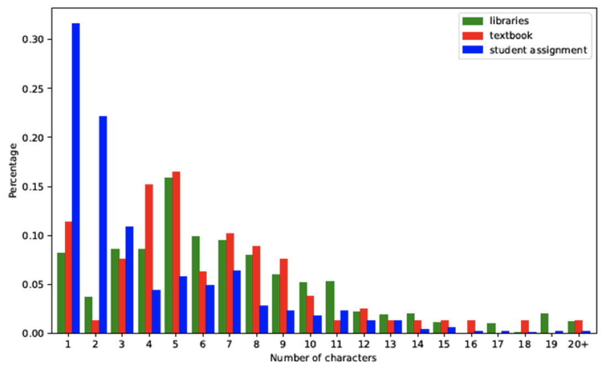
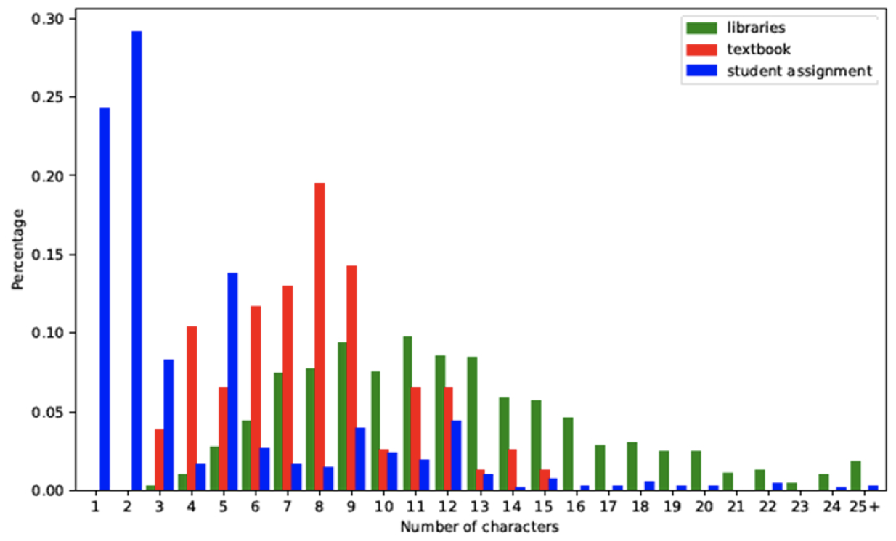
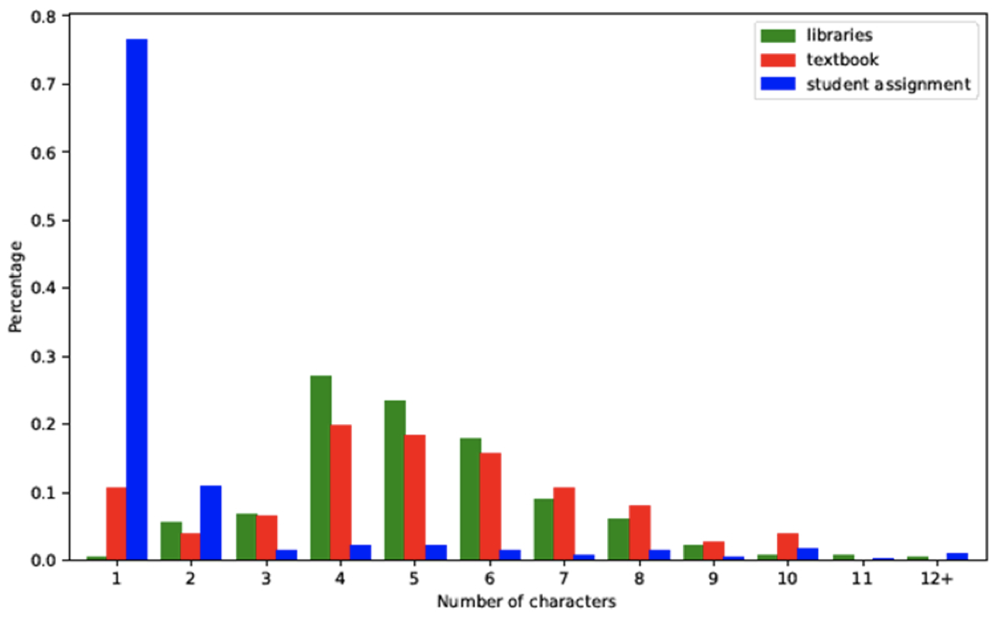

# Introduction

## Statement of the problem

Creating identifiers when writing programs is an important and necessary part of every developer’s job. As opposed to many other words used in source code, identifiers are created by the developer, not preset by libraries or programming languages. This fact in itself creates a task that must be addressed: Identifier names must be created and thought-over with care. To experienced professionals this task should come easily, but to students it is not so simple. Without the experience to know how to properly format an identifier based on its context, student-created identifiers often fall short of expectations. One such formatting aspect that is associated with them is name length. Name length is a good indicator of the general descriptiveness of a word. By conducting a Python study with the identifiers of students, Python libraries and textbooks, Wang et al. demonstrated a clear distinction with the identifier lengths of students.

In three different comparisons between student, library and textbook name lengths, libraries and textbooks tended to yield similar results while students largely differed. It is important to acknowledge that professional developers and writers of coding textbooks are two examples of those who follow Python standards and create overall quality programs. With this in mind, student identifiers with lengths that are shown to be different from accepted identifiers demonstrate a shortcoming of student ability. Here lies the problem regarding student developers and identifier names. The name-length example shows one piece of the puzzle that inexperienced programmers are faced with. While Python identifiers can technically be named freely, there is an importance to consider in carefully choosing names. Identifiers that are not thoughtfully named will likely cause difficulty for third party readers of the code. Even though `x` may be a variable that is able to identify an assignment, audiences of the code will not have this insider knowledge and therefore will not be able to read and comprehend thr program in an effective manner. Better yet, developers themselves will often have trouble in understanding their own code when they revisit it after a length of time. Detailed comments help in this case, but readability is still compromised when it is necessary to repeatedly refer to them. In addition, clear identifiers that are accurately descriptive are instrumental in debugging code as well as increasing parsing efficiency due to an increase in readability and comprehension.

Factors that can be associated with the quality of identifiers are length, style, grammar, existence of associated comments and comprehension. These naming qualities will be further discussed regarding their impact on overall identifier quality.

## Overall aim

The solution presented to solve this problem is NamePy, an identifier-focused linter for beginning Python developers. The tool will aim to assist students with creating quality identifiers that are similar to those made my professionals. At a glance, the tool will:

- Be leveraged by Python users
- Follow a predetermined set of standards
- Output error/suggestion messages when standards are not met
- Provide program scores

The study by Wang et al. used name-length and name-style for comparison to determine some "ideal" standards/suggestions for Python students. This same type of logic is what will drive the set of standards that the tool will use to evaluate identifiers. The features and their specifics are determined by the research done in the next section. With the features and their limits decided, the tool will parse its given program, find its identifiers and analyze them based on the standards. If names are determined to conflict with the predetermined rules of the linter, error messages will be produced in an attempt to help the user solve the issues. In addition to this, scores will be produced based on the evaluation for optimal visualization.

With the help of this tool, developers will be given feedback that helps to improve readability and code comprehension by naming identifiers in a better way.

## Background motivating research

This project idea initialized with my background in the Computer Science field starting as a beginner. There is much to learn at the beginning stages, so naturally there are some topics that are not taught to the fullest degree. For me, one such topic was naming conventions. Snake case, camel case, numbers, letters, identifier content and identifier types are all things that remained uncertain for me until I gained more experience as a student. As a student developer I am pursuing this project to aid other developers in the struggles that I experienced. On a personal level I am pursuing this project to learn more about the complexities of programmatic naming conventions, but also naming and language in a broad sense. Aside from my personal background, initial research into the area proved to offer more motivation as well. Information about identifier length, style, grammar and associated comments as well as the topics of reading comprehension and linting all aided with my creation and understanding of this project't goals.

* What is relevant and what is not?
* Data is relevant: add a set about beginner programmers
* Statement of the problem can include gravity and harms and all sorts of things like that
* Example: prevalence of thing, novelty of tool, intent of tool, motivation for why it is necessary

# Related Work

There are several aspects to consider when determining an adequate identifier name. It is necessary for it to be long enough to be descriptive, but short enough for comprehension. It is necessary for it to use part-of-speech grammar, but it is not certain what grammar is most effective. It is necessary for it to use a style type that is required by the program, but a style type is not always required. It is not always necessary to include descriptive comments, but there could be a correlation with comprehension. It is necessary for it to be easily comprehended, but many of the previously mentioned topics could affect its ability to do so. There is no correct or perfect way to name identifiers due to personal preference, but this research provides a way for developers to enforce a standard that will yield overall better results.

## Background of Identifiers

An identifier in a programming language is the term used to describe lexical tokens that name various things in a program (variables, functions, etc.). To create names for identifiers, it is important to view them in terms of language. Derek Jones makes the connection that "There are a number of situations in everyday life that require the use of arithmetic and binary concepts (e.g., switch light on/off, change mind and flag an error), and measurements confirm that words and phrases commonly used in human conversation are carried over into identifier names" [@Jones]. With this in mind, identifiers can be thought of in a largely similar way to natural language. This paves the way to looking at topics such as word length, grammar and comprehension when thinking about identifier creation. In addition to this, Annette Vee makes the distinction that "Computers are also socially contextualized; they are objects that are both controlled by language and can be used to manipulate linguistic symbols" [@Vee]. This defines identifiers as the lexical tokens that they are. This fact is what makes identifiers unique to programming as opposed to natural language. So, while it is important to view them as a type of language themselves, it is also important to remember their purpose in code: to symbolize.

## Identifier Length

Binkley et al. present a study that looks at short-term memory in relation to identifier names. The study was conducted in Java rather than Python, but nonetheless it remains relevant as a study conducted in a similar programming language. Several aspects of identifier names were seen to have affected the participants’ comprehension. One finding showed that more syllables equated to longer processing times and worse recall accuracy [@Binkley2009]. This shows that in general, longer identifiers (more syllables often equates to longer words) will take longer and be more difficult to comprehend. This contradicts the idea of making identifiers as descriptive as possible because they may end up too long at times. Rather, it suggests that they need to be as short as possible without compromising how descriptive they are. Interestingly, it was also found that longer name lengths had greater influence on experienced programmers [@Binkley2009]. This suggests that the necessary length of identifiers for better comprehension may change as a programmer becomes more experienced.

The use of "common identifiers" was also seen to improve recall accuracy with the participants of the study [@Binkley2009]. This shows that a larger amount of uniformity in identifier names (using more common words that are used often in the community as a whole) improves comprehension. More will be discussed about uniformity in the following sections.

Schankin et al. present another study that draws conclusions about longer, more informative identifier names. They state that “Code comprehension was assessed by measuring the time needed to find a semantic defect in the code, assuming that such a defect can only be detected if the code has been understood.” It was found that (particularly with more experienced developers) there was better comprehensibility with more descriptive names. In contrast to Binkley's study, it does not highlight the importance of keeping names concise. Similar to the previous study, developer experience has an affect on how short an identifier can be made while maintaining descriptiveness [@Schankin].

Another study performed by New et al. deals with a slightly different but fundamentally related topic: lexical decision. Using the English Lexicon Project, they “reexamined the effect of word length (number of letters in a word) on lexical decision” [@New]. Binkley's study that was previously mentioned focused on short term memory (shortening identifiers) while Schanklin's study focused on long term memory (lengthening identifiers). Compared to both of these, this study found that the effect of word length was not clear [@New]. Because both studies suggested different things, an unclear result justifies that contrast. These findings suggest that ideal identifier length is fluid according to various aspects. Given this, the tool created will not be able to suggest very specific standards regarding length, but rather it will lend guidance in a broader sense.

## Identifier Style

Davis et al. (also authored by Binkley as we have seen before) present an interesting study about identifier style in relation to effort and comprehension. The two main styles are examined in the study (camel case and snake case) in various ways to determine comprehensibility. The main takeaway of the article is that camel case yields better comprehension at the cost of more effort [@Binkley2013]. This project is focused in Python, so styles are determined by the official style guide. For example, class names should be typed with the **CapWords** convention and functions names should be typed with the **snake_case** convention [@Pep8]. Though the article's findings do not specifically matter for the purpose of this project, they prove a point of uniformity. The fact that there is a difference in comprehension between styles at all proves that using a uniform style in a program has value. Essentially, if Python developers had the freedom to use various styles in various places as they saw fit, the code would be less comprehensive in general and less readable to developers that follow the standard. Davis et al. give one piece of evidence here by showing the difference in comprehension between just two styles. It is clear that reading code with various styles (that are each easier or harder to comprehend) would result in code that is overall much harder to comprehend. The main takeaway is that uniformity is an important characteristic of identifier style, and thus it may be important relating to other identifier topics too.

## Identifier Grammar

Newman et al. present an investigation into identifiers in relation to the parts-of-speech used in them. The study found various results that could relate to this project. One such finding was that “Function identifiers are more likely to contain a verb and be represented by a verb phrase” [@Newman]. This makes sense due to the fact that functions have actions and verbs can adequately describe actions. This foundation of identifiers describing things based on their role (for instance a function completing an action) is key to creating understandable identifiers. This can be seen if, for instance, a function identifier were named with a noun. It would not adequately describe the function and therefore not be very comprehensive. This finding also shows that grammar patterns are naturally seen even with no direct convention required when creating identifiers. The fact that certain grammar conventions more adequately describe certain identifier types as well as the fact that these conventions are often seen naturally shows that a uniformity of grammar conventions is beneficial. Similar to uniformity with identifier style, maintaining consistent grammar conventions would aid with comprehension.

## Associated Comments

Takang et al. present a study that presents a new, rather overlooked idea when looking at identifiers: comments describing those identifiers. The results yield a surprisingly low correlation between program comprehension and identifiers being paired with comments. One potential reason for this was stated that "if the comments did not provide any new information that is not already conveyed in the identifier names, then the effect would be insignificant considering that exactly one of them would do just as well" [@Takang]. This reinforces the importance of making identifiers descriptive. Comments are not a technical part of source code, rather they are an aid for readers. As with any aid, they should not be relied on consistently. Rather, the identifiers should be relied on for code comprehension and therefore they should be the descriptive ones that make comments superfluous.

Song et al. present the fact that "some researchers have tried to define identifiers with a long descriptive name in order to implement self-commented code. However, it makes code comprehension more difficult" [@Song]. It is true that there are practical limits to identifier lengths and therefore limits to how descriptive they can be. Because of this, a combination of descriptive identifiers and descriptive comments is the best answer.

## Reading Comprehension

Schoeman presents an eye-tracking study that involves reading skills in relation to programming. Her results showed that there is a direct correlation between reading skill and program comprehension. Given that younger students are generally those that lack in reading skills, the study would be mostly relevant to student developers. One main takeaway is that “program flow is not sequential, requiring a substantial degree of selective attention, organizing and reflecting, executed simultaneously in the limited working memory” [@Schoeman]. This idea is helpful when thinking about identifiers as well. It is essential to know that the reader is going through a complex flow in their head when trying to understand the program as a whole (identifiers included). This makes it even more important for identifiers to fit in the program and flow smoothly by having the best names possible.

Annette Vee has an exert in her book that reads "Like reading, [programming] is comprised of a large number of abilities that interrelate with the organization of the learner’s knowledge base, memory and processing capacities, repertoire of comprehension strategies, and general problem-solving abilities. ... As reading is often equated with skill in decoding, 'learning to program' in schools is often equated with learning the vocabulary and syntax of a programming language. But skilled programming, like reading, is complex and context-dependent" [@Vee]. This exert adds onto the previous point that there is a complexity associated with programming similar to that of linguistic aspects of reading. Since the processes are similar, there is justification in saying that ability to read and comprehend written text has bearing on ability to read and comprehend programs. These connect via literacy according to Vee. This will be discussed in the `Coding as Literacy` section.

Given these points about reading comprehension, it should be possible to develop a readability score for identifiers in a similar way to scoring written text. By incorporating the other mentioned topics, a score could be further elongated to provide better and more descriptive score results.

## Linting

Linting originates from a Unix utility "which examines C source programs, detecting a number of bugs and obscurities." It was used as a tool to enforce the rules of C more than the compiler alone [@Johnson]. From the original C linter to today's Python linters, the fundamental purpose has not changed. In Python, "Linting highlights syntactical and stylistic problems in your Python source code, which often helps you identify and correct subtle programming errors or unconventional coding practices that can lead to errors" [@VSCode]. Essentially, linters are intended to catch errors in order to improve source code. The aim of this project is to do the same thing with identifiers. Poorly named identifiers will be caught and the user will have a better understanding of how to make them better. Given this, the methods outlined in the next section focus on linting at various levels in regard to identifiers.

Another term that is often used as a replacement for `linter` is `static analysis tool`. A list that is comprised of the widely used static analysis tools for every programming language can be found at [this](https://github.com/analysis-tools-dev/static-analysis) GitHub repository. Included in this list are three linters that hold high reputations and most closely resemble NamePy. These tools are `pylint`, `flake8` and `pycodestyle`. Being Python linters, they are intended to catch syntactical and stylistic errors in source code. It is important to note, though, that these tools (including NamePy) are largely suggestive in nature. The use of linters is not technically required in any instance unless otherwise specified by a manager of a project. PEP8 (the official Python style guide) notes that "A style guide is about consistency. Consistency with this style guide is important. Consistency within a project is more important. Consistency within one module or function is most important" [@Pep8]. This quote suggests that the importance of linting lies in the aspect of consistency. In this way, while linters are not required, they are encouraged due to the consistency that they bring. Ultimately, the creators of linting tools are able to choose the style guide that they follow. This may include rules from PEP8 as well as rules that are not official according to the Python language. Despite the rules (as mentioned before) the importance is the consistency that the tool brings. `pylint`, `flake8` and `pycodestyle` are comprised of style guides that many Python developers agree with and depend on. For this reason, NamePy will be compared to them in following section.

# Template description

This repository contains the starter materials for your thesis in Computer Science 600 and 610 
in Summer 2022 academic term. The main directory of this repository contains the Markdown template
for a project that is designed for use with GitHub Classroom. To learn more about the course in 
which these assignments were completed, please visit the 
[Computer Science Thesis Summer 2022 Allegheny College GitHub Organization](https://github.com/Allegheny-ComputerScience-600-Sum2022).

The template specifies various settings in the `config.yaml` file included in the
repository. Change the appropriate values under the `Project-specific values` 
heading. Changing other values outside of that section may cause the project to
fail to build. **Modify these values at your own risk.**

Author your thesis in the `thesis.md` document using appropriate Markdown
hierarchy and syntax; GitHub Actions will automatically create a PDF from the
`abstract.md` and `proposal.md` files. Consult the `README` of the proposal
repository to learn how to properly build and release this PDFs.

Including references throughout requires a specific pseudo-Markdown tag, demonstrated
in the following blockquote. (Inspect the `thesis.md` file to see the format.)

> A citation, when included correctly, will appear as it does at the end of this
> sentence. [@plaat1996research]

To label a figure (i.e. an image), referencing the image using correct Markdown
will automatically caption the figure:

> 

Two things specific to this template to also keep in mind:

1. It is your responsibility to remove this description section before building
the PDF version you plan to defend.
2. References _will only appear if cited correctly_ in the text

# Introduction

This chapter describes your completed senior thesis work, 
including the overall aims  and the background motivating your research. Whenever 
possible, you should use one or more concrete examples and technical diagrams. 

It is often useful and necessary to separate the introduction into multiple sections. 
Several possible sections are proposed below, you can use these or distribute your 
introductory text into sections in another way.

The headings below propose _one way_ you might structure this section of the document.

## Motivation

## Current State of the Art

## Goals of the Project

## Ethical Implications

This document requires that you discuss the ethical implications of your work -- no
matter how benign you consider the outcome of your project. As several major studies
of ethical issues in computer science assert: _no project is completely value-neutral_.

To assist you in elaborating on these issues, the following areas are topics you might
consider addressing. You do not need to address all of them.

* Information Privacy
* Information Accuracy (e.g. can contain reliability)
* Potential Misuse (e.g. computer crime, unintended consequences)
* Second- or Third-Party Risk (e.g. safety)
* Data Collection Issues (e.g. issues inherent in collecting data)
* Algorithmic or Data Bias
* Potential Power Difference / Social Imbalance / Issues in Equity

In addition, reflect on ways that the above harms can be or are mitigated by your work

# Related work

This chapter includes a broad and detailed review of relevant existing work. 
The literature review should provide background and context for the thesis work. 
The subsections may be organized in whatever manner seems best suited to the material--
chronological, or by topic, or according to some other criteria 
(e.g., primary versus secondary resources).

If ethical issues are central to this work, you should also address historical and 
contemporary issues or efforts made to address them.

# Method of approach

This chapter answers the "how" question - how did you complete your project, 
including the overall design of your study, details of the algorithms and tools you 
have used, etc.  Use technical diagrams, equations, algorithms, and paragraphs of text 
to describe the research that you have completed. Be sure to number all figures and 
tables and to explicitly refer to them in your text.

This should contain:

* lists
* with points
* and more points
  * possibly subpoints

For those projects whose implications address social or moral issues (i.e. ethical
standards, causes, effects), you will want to use this section to describe how you
actively mitigated or considered these issues.

# Experiments

This chapter describes your experimental set up and evaluation. It should also 
produce and describe the results of your study. The section titles below offer
a typical structure used for this chapter.

## Experimental Design

Especially as it pertains to responisble computing, if conducting experiments or 
evaluations that involve particular ethical considerations, detail those issues here.

## Evaluation

## Threats to Validity

# Conclusion

Traditionally, this chapter addresses the areas proposed below as sections, although 
not necessarily in this order or organized as offered. However, the last section --
"Ethical Implcations" is required for this chapter. See the heading below for more 
details.

## Summary of Results

## Future Work

## Future Ethical Implications and Recommendations

Especially as pertains to the public release or use of your software or methods, what
unresolved or special issues remain? What recommendations might you make?

## Conclusions

# References

::: {#refs}
:::
